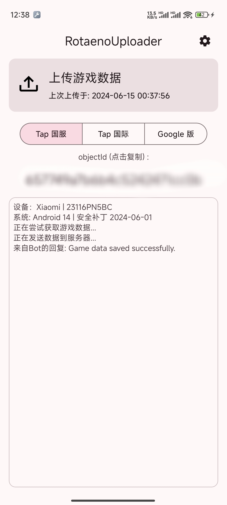
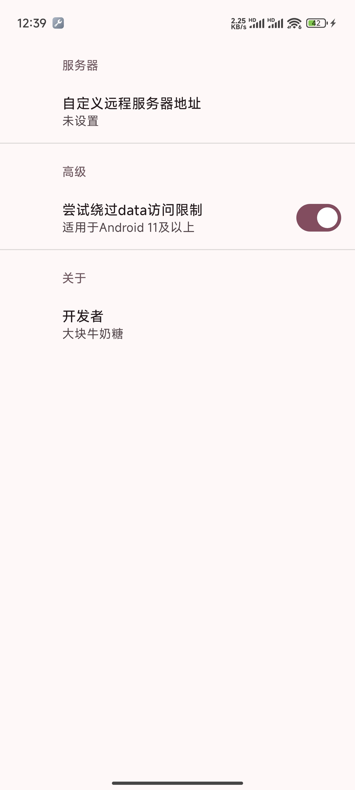

# RotaenoUploader

## 简介

RotaenoUploader 可以上传游戏 Rotaeno （旋转音律） 的保存数据到指定服务器，通常用于成绩分析。

## 功能

- 上传游戏保存数据到指定服务器
- 复制 ObjectId 到剪贴板
- 支持绕过从Android 11开始的/Android/data/路径访问限制

## 截图




## 使用说明

1. 打开应用程序，点击右上角进入设置，填入服务器地址。
2. 回到主界面，点击“上传游戏数据”卡片，应用会自动获取游戏数据，解析出objectId并将游戏存档并上传到指定的服务器。

## 上传格式

上传的数据是以 JSON 格式发送到服务器的，具体格式如下：

```json
{
  "object-id": "string",
  "save-data": "base64_encoded_string"
}
```

- `object-id`：唯一标识符。位于/storage/emulated/0/Android/data/com.xd.rotaeno.googleplay/files/RotaenoLC/.userdata
- `save-data`：经过 Base64 编码的游戏保存数据内容。位于/storage/emulated/0/Android/data/com.xd.rotaeno.googleplay/files/路径下。

游戏的保存数据是加密的，本应用只会原封不动上传，不负责解密。

## 声明

本应用只会读取游戏数据，不会修改。游戏数据只会上传到您指定的服务器，不会与官方服务器通信。
开发者本着对此游戏的喜爱开发了这个应用，请勿用于非法用途。

## 联系方式

如果您有任何问题或需要帮助，请联系：

- 邮箱：ohayo@milkycandy.cn

## 开源协议

RotaenoUploader 遵循 Apache 2.0 开源协议。详情请参见 [LICENSE](LICENSE) 文件。

---