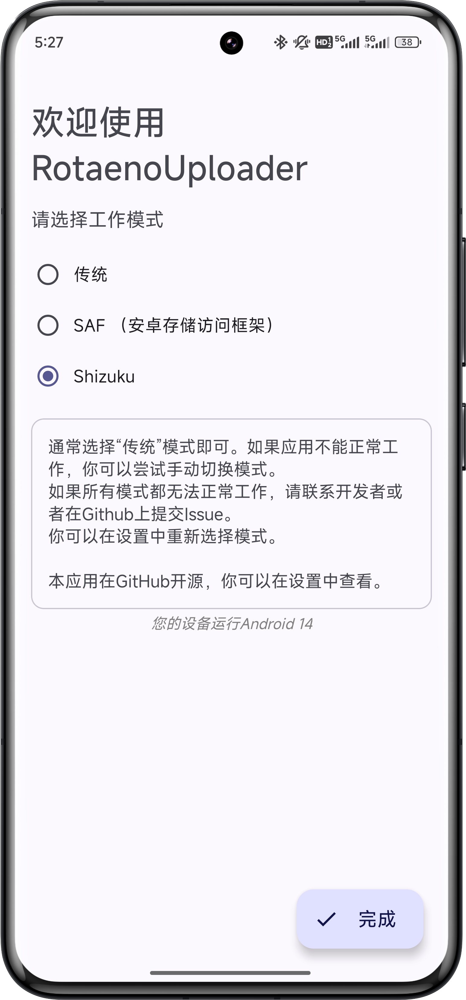
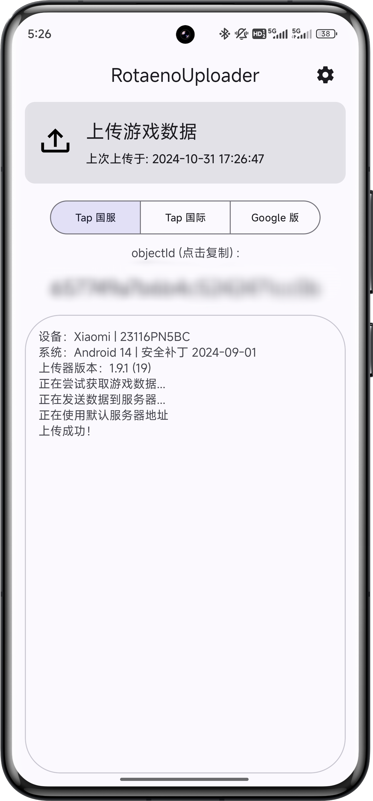
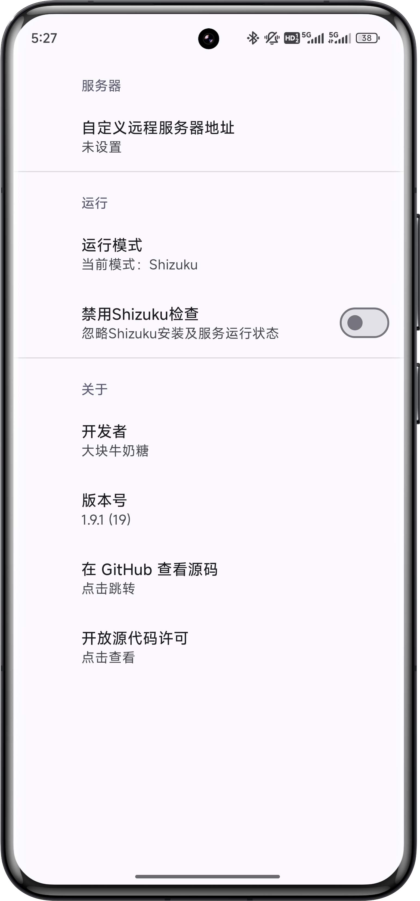

# RotaenoUploader

写的太垃圾了，准备推倒重写了。

## 简介

RotaenoUploader 可以上传游戏 Rotaeno （旋转音律） 的保存数据到指定服务器，通常用于成绩分析。  
兼容 Android 7.0 及以上系统。

## 功能

- 上传游戏保存数据到指定服务器
- 复制 ObjectId 到剪贴板
- 支持绕过从Android 11开始的/Android/data/路径访问限制
- 支持使用Shizuku服务访问游戏数据，作为高版本Android限制data访问的替代方案

## 截图

|              欢迎向导               |             主界面             |               设置               |
|:-------------------------------:|:---------------------------:|:------------------------------:|
|  |  |  |


## 使用说明

1. 打开应用程序，点击右上角进入设置，填入目标服务器地址。
2. 回到主界面，点击“上传游戏数据”卡片，应用会自动获取游戏数据，解析出objectId并将游戏存档并上传到指定的服务器。

## 网络请求流程

RotaenoUploader 通过 HTTP POST 请求将游戏数据上传到指定服务器。数据的发送格式和请求细节如下：

1. **请求方法**：使用 `POST` 方法，发送 JSON 数据。
2. **请求头**：
    - `Content-Type: application/json; charset=utf-8`
3. **请求体格式**：
   请求体为 JSON 格式，包含两个字段：
   ```json
   {
     "object-id": "string",
     "save-data": "base64_encoded_string"
   }
   ```
    - `object-id`：游戏数据的唯一标识符，用于在服务器端区分不同用户的数据。
    - `save-data`：经过 Base64 编码的游戏数据，保证数据可以以文本方式传输。

## 声明

本应用只会读取游戏数据，不会进行任何修改或与官方服务器通信。所有数据传输仅在您指定的服务器之间进行，且不会进行解密操作。  

## 联系方式

如果您有任何问题或需要帮助，请提交Issue或联系：

- 邮箱：ohayo@milkycandy.cn

## 开放源代码许可

RotaenoUploader 使用 Apache License 2.0 。详情请参见 [LICENSE](LICENSE) 。

---
